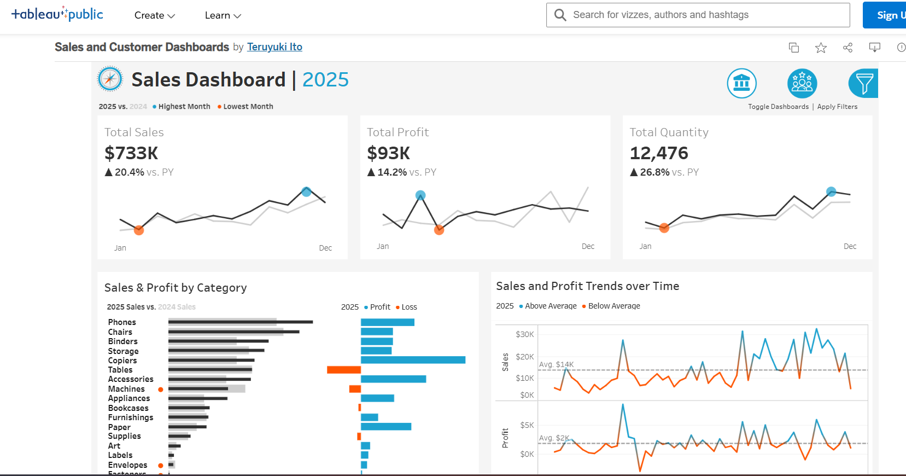
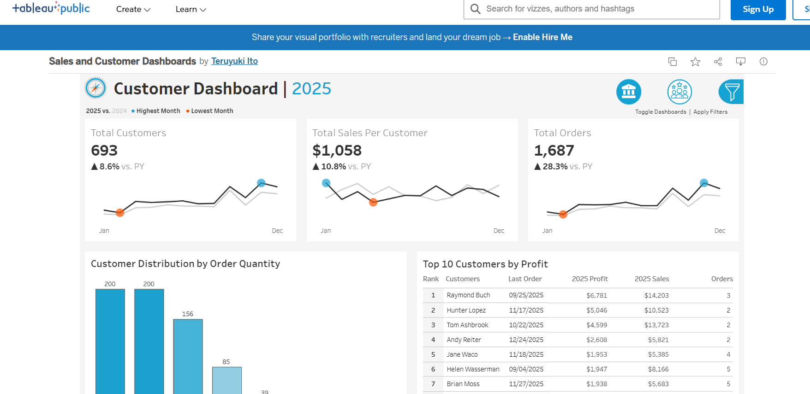
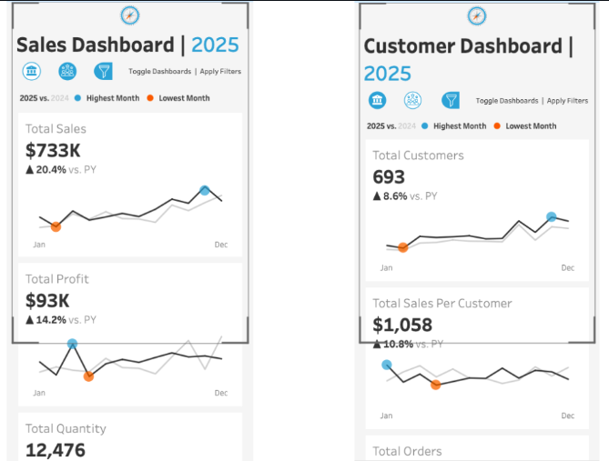
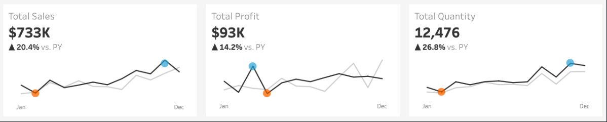
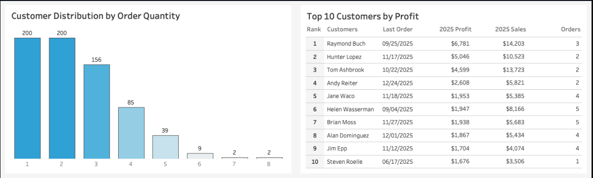
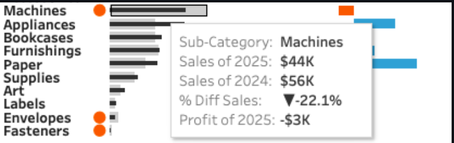

## Sales and Customer Analytics: Dynamic Tableau Dashboards for Jayson Supplies Ltd.

# Executive Summary
Jayson Supplies Ltd. requires a transition from static reporting to dynamic analytical dashboards to navigate sales performance and customer loyalty effectively. This project delivers a suite of high-impact deliverables designed to transform transactional data from 2022 to 2025 into a strategic roadmap for growth.

[View Interactive Sales Dashboard on Tableau Public](https://public.tableau.com/app/profile/teruyuki.ito/viz/SalesandCustomerDashboards_17828597009330/SalesDashboard?publish=yes)

The primary deliverables include interactive Sales and Customer dashboards and a comprehensive User Guide. The Sales Dashboard serves as a diagnostic tool providing a comprehensive overview of sales metrics, enabling deep-dives into Year-over-Year (YoY) performance, seasonal trends, and product-level profitability. The Customer Dashboard offers a specialized interface for marketing and management teams to analyze customer segments, behavior, and loyalty metrics. By centralizing critical KPIs and seasonal trends, this solution empowers executives to pinpoint profit leakages and identify high-value customer segments, ensuring every marketing investment drives measurable growth. Click on Sales & Customer Dashboards to interact with the dashboards on Tableau Public. Find the User Guide, Dashboard Building Process, and Requirements Elicitaion Document at the top this page.

## Full view of Sales Dashboard

## Full view of Customer Dashboard

# Business Problem: The Need for Clarity
Jayson Supplies Ltd. faced a common corporate challenge: fragmented data that obscured real-time performance and hindered proactive decision-making. Management needed to move beyond basic totals to understand the nuances of growth, regional fluctuations, and customer retention across a four-year period.

The primary objective was to build a diagnostic tool capable of answering critical business questions. Stakeholders needed to know how current sales and profits compared to previous year benchmarks and which specific months represented seasonal peaks or troughs across different years. From a product perspective, there was a critical need to identify if certain subcategories, such as "Tables" or "Machines," were generating revenue at the expense of profit. Furthermore, the marketing team required a way to distinguish loyal customers from those at risk of churning, while operational leads needed to identify which weeks outperformed historical averages to understand the triggers behind those spikes.

# Tools and Methodology: The Analytical Journey

Source of Datasets
The analysis used a comprehensive sales dataset sourced from GitHub. The data reflects consistent reporting across all regions from 2022 to 2025. For the purpose of this analysis, it was assumed that data integrity was maintained across all transaction types to allow for a seamless 24-hour refresh cycle reflecting the previous day’s close.

Tech Stack
Tableau Desktop & Cloud: The primary engine for visualization, advanced calculations, and interactive data exploration.
Transactional Database: The core repository for all sales and customer records.
Google Drawings: Employed during the initial mockup phase to define container structures and the user interface (UI) flow.
Dashboard Building Process
The project followed a five-stage process to ensure technical excellence and business alignment:

Requirement Analysis: 
Stakeholder needs were translated into specific chart types. Big Ass Numbers (BANs) were selected for immediate KPI recognition, while Bar-in-Bar charts were chosen for YoY comparisons and Diverging Bars for profit/loss analysis.

Data Source Construction: 
This involved connecting the data, creating a data model through relationships, and field renaming to ensure the data was understandable for end-users.

Advanced Chart Development: 
Beyond basic visualizations, Calculated Fields were developed and tested. These enabled the creation of dynamic Year-over-Year comparisons and automated peak/trough identifiers, and "Highest Month" and "Lowest Month" indicators on monthly sparklines, reducing the cognitive load on executives.

Dashboard UI/UX Design: 
A cohesive color palette was applied, featuring slate grey (#303030) for trends, blue (#1DA2D0) for positive markers, and orange (#FF5500) for performance alerts or losses. The container structure was built to ensure all content was distributed evenly and fit the "Entire View" for professional presentation.

Mobile Optimization: As the final stage, the dashboards were specifically reformatted for mobile devices. This ensures that executives can access critical insights via smartphones with tailored layouts that prioritize readability on smaller screens.

Mobile Phone view of Dashboards

Skills Demonstrated
The completion of this project required a blend of technical proficiency and strategic thinking:

Data Visualization & Storytelling: 
Crafting intuitive interfaces that guide a user from high-level KPIs to granular, actionable insights.

Tableau Proficiency: 
Application of Calculated Fields, Parameters, Level of Detail (LOD) expressions, sparklines, and interactive filtering.

UX/UI Design for Analytics: 
Using color theory and container-based layouts to improve data legibility and user engagement.

Mobile Business Intelligence: 
Designing responsive layouts specifically for on-the-go executive consumption.

Requirements Engineering: 
Translating vague business needs into technical specifications and user stories.

Strategic Thinking: 
Linking data points (like low order frequency) to specific business recommendations (like loyalty campaigns).

Sales Dashboard Deep Dive: 
Revenue and Performance
The Sales Dashboard provides a diagnostic overview of the company's financial health. In 2025, the organization reached a Total Sales of $733K, representing a 20.4% increase over the previous year. While Total Profit also grew by 14.2% to $93K, the disparity between sales growth and profit growth suggests a need for operational efficiency reviews.

Sales Dashboard KPI section with sparklines

The dashboard uses Sparklines to show the month-over-month trend for the current year (black line) against the previous year (grey line). Automated markers highlight sales peak in November, while February represents a trough.

A critical component of this dashboard is the Sales and Profit by Category section. It uses a Bar-in-Bar chart to visualize YoY subcategory performance. Orange dots are applied to subcategories where current sales have fallen behind the previous year, such as in "Machines," "Envelopes," and "Fasteners." Furthermore, a diverging bar chart on the right highlights that "Tables" are currently incurring a significant loss despite being a top-tier revenue generator.

# Customer Dashboard Deep Dive: 
Behavior and Loyalty
The Customer Dashboard shifts the focus from "what was sold" to "who is buying". By 2025, the active customer base grew to 693 individuals, an 8.6% increase. More importantly, the Total Sales Per Customer rose by 10.8% to $1,058, indicating that the company is successfully extracting more value from its existing base.

Customer Distribution by Order Quantity and Top 10 Customers by Profit

Analytical thinking is best demonstrated in the Customer Distribution by Order Quantity chart. The visualization reveals a significant hurdle: 400 customers (nearly 58% of the base) have placed only one or two orders. This insight identifies a massive opportunity for the marketing team to convert these "one-hit wonders" into repeat buyers.

The Top 10 Customers by Profit table provides a granular look at the company’s most valuable assets. It ranks customers like Raymond Buch, who generated over $6,700 in profit from just three orders, allowing the sales team to prioritize high-touch relationship management for these VIP accounts.

# Executive Insights and Strategic Recommendations
The combination of these dashboards uncovers several areas where Jayson Supplies Ltd. can take immediate action to improve its bottom line:

1. Address the "Table" Paradox: The data shows that "Tables" are high-volume but high-loss. Management should conduct a pricing audit or renegotiate supplier contracts to ensure this category contributes to, rather than detracts from, total profit.

2. Reverse Underperformance in Machines: "Machines" show both a YoY sales decline (highlighted by the orange dot) and a net loss. A strategic review is required to determine if this category should be discontinued or restructured.

3. Bridge the Loyalty Gap: With 400 customers stuck at 1-2 orders, the marketing department should implement automated "Next Best Offer" email campaigns triggered after the second purchase to drive them toward the third-order milestone.

4. Operationalize Seasonality: Since November is the "Highest Month" for sales across KPIs, the supply chain team should increase inventory levels starting in October to avoid stockouts during the peak.

Tooltip showing specific loss details for the "Machines" sub-category

# Conclusion
This project delivers more than just visualizations; it provides a comprehensive decision-support system. By automating the data flow and providing mobile-optimized, interactive views, the dashboards save hours of manual reporting time each week. The inclusion of a detailed User Guide ensures that stakeholders can independently navigate filters, utilize tooltips for granular details, and export high-quality snapshots for board presentations. Ultimately, the value of this analysis lies in its ability to move the organization from reactive observation to proactive strategy. Jayson Supplies Ltd. now has the clarity to minimize losses in underperforming product categories and maximize the lifetime value of every customer, ensuring sustainable growth through 2025 and beyond.

The Filter Panel showing drill-down capabilities by Year, Product, and Location
Sales-and-Customer-Dashboard/Filter Panel.png

